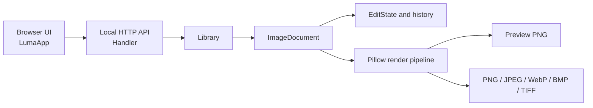

# Luma Studio

**Luma Studio** is a local image editor with a browser-based interface and a Python/Pillow processing core. It is designed as a small, inspectable application: the browser owns presentation and interaction, while image transformations and exports run in a local Python process.

The application listens on `127.0.0.1` and does not send image content to a remote service.

## Capabilities

- Open and switch between multiple images in one session. Every image has its own edit state and undo/redo history.
- Apply eight presets: original, monochrome, sepia, vivid, soft, cool, warm, and sharpen.
- Adjust brightness, contrast, and saturation independently from 0 to 200 percent.
- Rotate by 90 degrees and resize with optional aspect-ratio preservation.
- Preview a bounded-resolution render and export the current image at full output resolution.
- Export to PNG, JPEG, WebP, BMP, or TIFF.
- Add images through the file picker or drag-and-drop. Supported source formats include PNG, JPEG, WebP, BMP, TIFF, and GIF (first frame).

## Design

The code separates the user interface, transport, collection management, and image model. This keeps the processing rules independent from browser controls and gives future features clear extension points.



### Processing model

`ImageDocument` retains the decoded source image and a compact `EditState`. Edits update state rather than replacing the source pixels. Undo and redo move prior states between per-document stacks. Preview and export use the same render pipeline so the visible result and saved result follow the same transformation order.

The pipeline applies EXIF orientation, quarter-turn rotation, Lanczos resizing, the selected filter, then brightness, contrast, and saturation. Alpha is preserved when supported by the output format; JPEG and BMP use a white matte for transparent input.

`Library` owns the ordered collection of open documents. `Handler` exposes the HTTP API and static frontend. In the browser, `ApiClient` wraps requests and `LumaApp` synchronizes controls, selection, and preview state.

## Run locally

Requirements: Python 3.10 or newer and Pillow.

```powershell
pip install -r requirements.txt
.\run.ps1
```

The launcher opens `http://127.0.0.1:8765` in the default browser. To stop the application, press **Ctrl+C** in PowerShell. The server can also be started with `python server.py`.

Keyboard shortcuts: **Ctrl+O** add images, **Ctrl+S** export, **Ctrl+Z** undo, and **Ctrl+Y** redo.

## Project layout

```text
server.py          Local HTTP server, API routes, and Library
processing.py      ImageDocument, EditState, filters, and export
web/index.html     Interface structure
web/styles.css     Interface styling
web/app.js         ApiClient and LumaApp
requirements.txt   Python runtime dependency
run.ps1            Windows launcher
```

## Runtime boundaries

- Open files and edit history live in process memory and are cleared when the server stops. Export any result that should be kept.
- Uploads are limited to 35 MB. Images are capped at 100 million pixels to limit accidental memory exhaustion.
- The server binds to loopback only. It is intended for one local user, not as a public or multi-user service.
- Preview requests are downsampled to a maximum edge of 1,800 pixels; exports render from the retained source at the selected output size.

## Extension points

Add a filter to `FILTERS` and `ImageDocument.render`, then add its label to the browser filter list. New editing operations belong in `Library.update`; the browser can expose them through `ApiClient` and `LumaApp`. Persistent projects, crop geometry, batch export, and a background job queue can be introduced without coupling those features to the current presentation layer.
